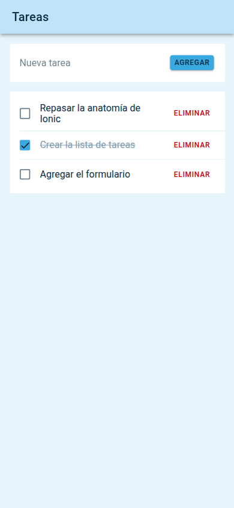
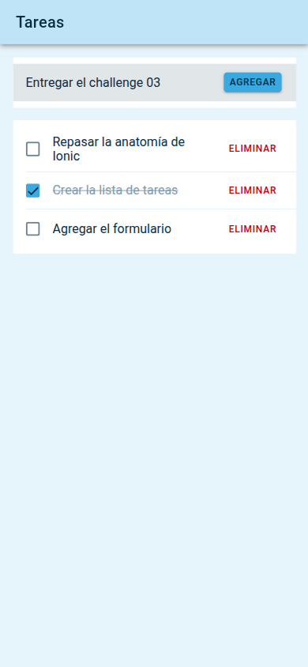
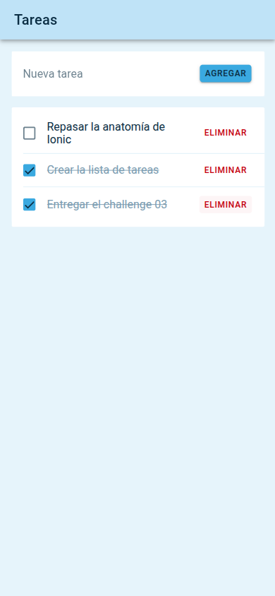

# Tareas

App de tareas hecha con Ionic y React para el challenge 03. Permite ver la lista de tareas, agregar nuevas, marcarlas como completadas y eliminarlas.

## Capturas

| Lista inicial | Agregar una tarea | Tarea completada |
| --- | --- | --- |
|  |  |  |

## Componentes

- Home (src/pages/Home.tsx): la pantalla. Guarda las tareas en estado y define las funciones de agregar, marcar y eliminar.
- TaskForm: el campo de texto y el botón para agregar una tarea.
- TaskList: recorre las tareas y pinta un TaskItem por cada una.
- TaskItem: una fila con su casilla para completarla y su botón para eliminarla. Avisa al padre con onToggle y onDelete.

## Correr local

Hace falta tener instalado el Ionic CLI:

```
npm i -g @ionic/cli
```

Luego:

```
npm install
ionic serve
```

Se abre en http://localhost:8100. En Chrome, con F12 y el modo de dispositivo, se ve como en un celular.
