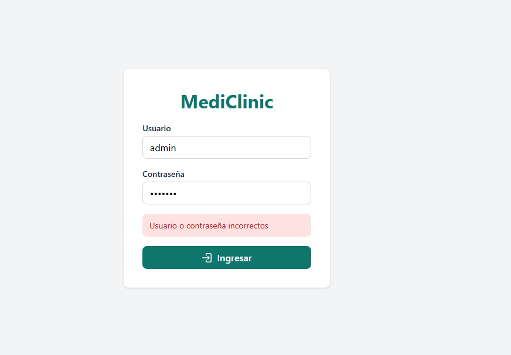
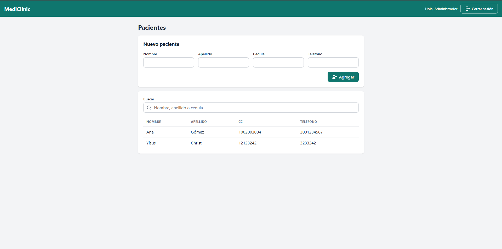
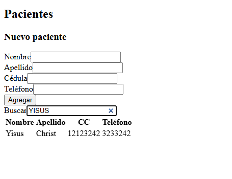
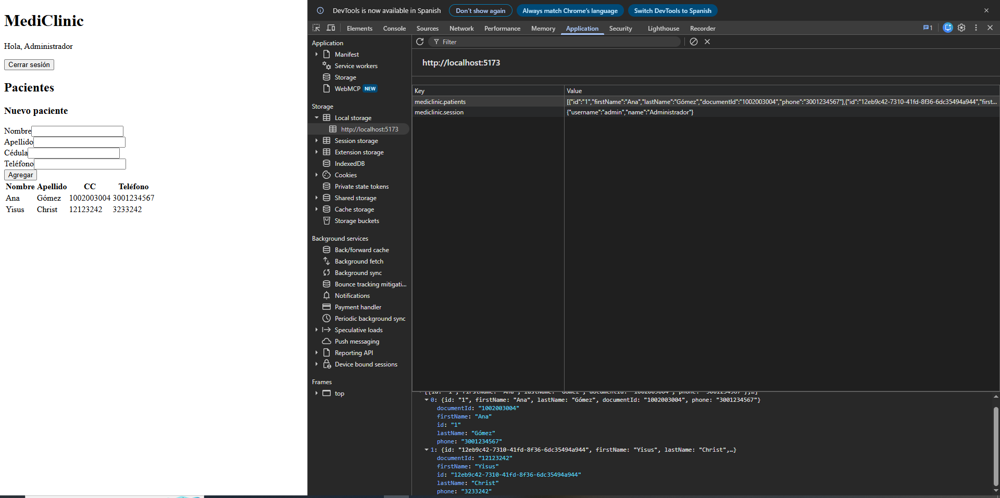
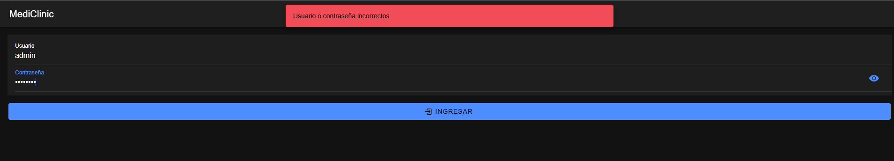
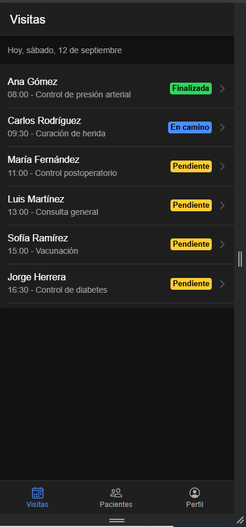
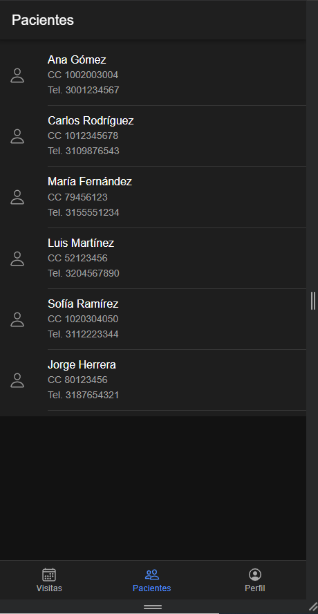
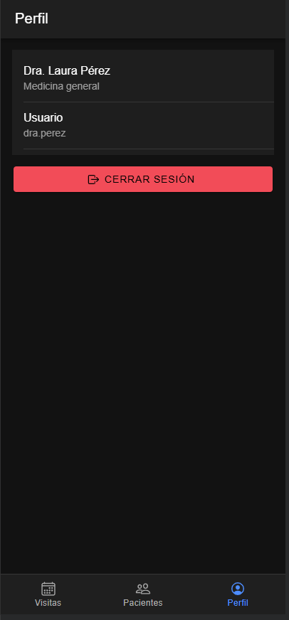

# Parcial 1, Desarrollo de Plataformas Móviles

Autor: Gabriel Martínez
Rama de entrega: `parcial-1-gabriel-martinez`

La clínica MediClinic necesita dos aplicaciones para gestionar pacientes y visitas médicas. Este repositorio contiene ambas, cada una en su propia carpeta, sin backend y con toda la persistencia en localStorage. Las dos apps no comparten información entre ellas.

| Carpeta | Ejercicio | Tecnología |
|---|---|---|
| `pwa-pacientes/` | Ejercicio 1, PWA React | Vite, React 19, TypeScript |
| `ionic-visitas/` | Ejercicio 2, Ionic React | Ionic React 9, React 19, Capacitor 8 |
| `imagenes/` | Capturas de pantalla de ambas apps | |
| `consigna/` | Enunciado del parcial en PDF | |

## Requisitos

- Node.js 24 o superior y npm.
- Ionic CLI (`npm install -g @ionic/cli`) solo si quieres usar `ionic serve` en el ejercicio 2. También funciona con `npm run dev`.

## Ejercicio 1, PWA de pacientes

### Cómo arrancar

```powershell
cd pwa-pacientes
npm install
npm run dev
```

Abre la URL que muestra Vite (por defecto `http://localhost:5173`).

Para probar el build de producción y el modo sin conexión:

```powershell
npm run build
npm run preview
```

### Usuarios de prueba

| Usuario | Contraseña |
|---|---|
| `admin` | `admin123` |
| `recepcion` | `clinic2026` |

### Funcionalidades

- **Login** con usuarios fijos. Si las credenciales son correctas la sesión se guarda en localStorage (sin la contraseña) y se recupera al recargar. Hay botón de cerrar sesión y mensaje de error en pantalla cuando fallan.
- **Pacientes**: lista y formulario con nombre, apellido, cédula y teléfono. Se validan nombre y apellido (obligatorios, solo letras, mínimo dos) y cédula (obligatoria, de 6 a 10 dígitos, sin repetir). Los pacientes se guardan en localStorage.
- **Búsqueda** por nombre, apellido o cédula, sin distinguir mayúsculas ni tildes. El estado del buscador vive en el componente padre (`Patients`) y la lista ya filtrada se envía por props al hijo (`PatientList`).
- **PWA** hecha a mano, sin plugins: `public/manifest.json` con íconos, y `public/service-worker.js` con estrategia de red primero y respaldo en cache, lo que permite abrir la app sin conexión después de la primera visita.

### Estructura

```
src/
  components/   Login, Home, Patients, PatientForm, PatientList, PatientSearch, icons
  data/         usuarios fijos y tipos de paciente
  hooks/        useAuth, usePatients
  services/     lectura y escritura en localStorage
  utils/        validación y búsqueda
  global.css    estilos de toda la app
```

Claves de localStorage: `mediclinic.session` y `mediclinic.patients`.

### Capturas

Login con error de credenciales:



Formulario, lista y buscador de pacientes:



Búsqueda funcionando:



Pacientes guardados en localStorage:



## Ejercicio 2, app Ionic de visitas

### Cómo arrancar

```powershell
cd ionic-visitas
npm install
ionic serve
```

O sin Ionic CLI: `npm run dev`. Abre la URL que muestra la consola (por defecto `http://localhost:8100` con Ionic o `http://localhost:5173` con Vite).

Para instalar en un celular Android (opcional):

```powershell
npm run build
npx cap add android
npx cap sync android
adb devices
ionic cap run android --target <ID del dispositivo>
```

### Usuario de prueba

| Usuario | Contraseña | Nombre |
|---|---|---|
| `dra.perez` | `medico123` | Dra. Laura Pérez, Medicina general |

### Funcionalidades

- **Login** con componentes de Ionic (`IonInput`, `IonButton`, `IonInputPasswordToggle`). Si las credenciales son incorrectas aparece un `IonToast`. La sesión se guarda en localStorage y se recupera al recargar.
- **Navegación** con `IonTabs` después del login: Visitas, Pacientes y Perfil.
- **Visitas**: muestra las visitas del día, cada una con paciente, hora y estado. Al tocar una se navega al detalle, donde un botón avanza el estado en el orden `pendiente`, `en_camino`, `finalizada`. Los cambios se guardan en localStorage.
- **Pacientes**: lista de los pacientes propios de esta app.
- **Perfil**: datos del médico y botón de cerrar sesión.

Las visitas se generan para la fecha actual la primera vez que se abre la app en el día, así siempre hay visitas "de hoy" para consultar.

### Estructura

```
src/
  components/   Tabs, VisitStatusBadge
  pages/        Login, Visits, VisitDetail, Patients, Profile
  data/         médico, pacientes y visitas iniciales, estados de la visita
  hooks/        useAuth, useVisits, usePatients
  services/     lectura y escritura en localStorage
  utils/        fechas y pacientes
```

Claves de localStorage: `mediclinic-visitas.session`, `mediclinic-visitas.visits` y `mediclinic-visitas.patients`.

### Capturas

Login con toast de error:



Visitas del día con estados:



Pacientes y perfil en vista móvil:




El resto de capturas del proceso está en la carpeta `imagenes/`.

## Condiciones cumplidas

- Sin backend.
- Toda la persistencia con localStorage.
- Las aplicaciones no comparten la información de los pacientes: cada una tiene su propio origen y sus propias claves de almacenamiento.
