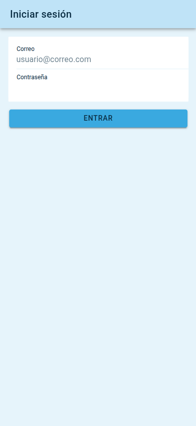
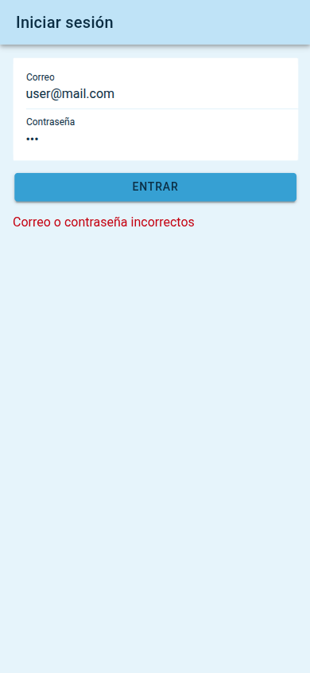
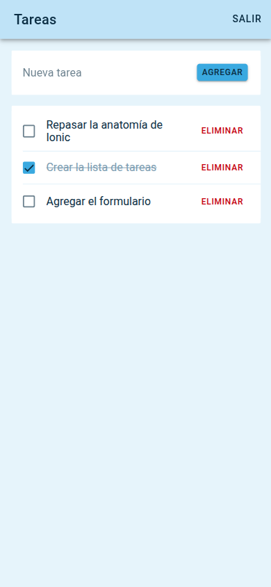

# Tareas

App de tareas hecha con Ionic y React. Es el challenge 03 (gestor de tareas) más el challenge 04 (inicio de sesión con sesión guardada).

Permite ver la lista de tareas, agregar nuevas, marcarlas como completadas y eliminarlas. Para llegar a la lista hay que iniciar sesión, y la sesión se recuerda para no tener que hacerlo cada vez.

## Capturas

| Inicio de sesión | Credenciales incorrectas | Lista con sesión iniciada |
| --- | --- | --- |
|  |  |  |

| Lista inicial | Agregar una tarea | Tarea completada |
| --- | --- | --- |
|  |  |  |

## Inicio de sesión

Credenciales de prueba:

- Correo: user@mail.com
- Contraseña: 123

Al entrar con ellas se guarda la marca logged en localStorage y la app pasa a la lista. Si se abre la app de nuevo con la marca guardada, va directo a la lista sin pedir credenciales. El botón Salir de la lista borra la marca y vuelve al inicio de sesión. Si se intenta abrir la lista sin sesión, la app redirige al inicio de sesión.

## Componentes y archivos

- Home (src/pages/Home.tsx): la lista. Guarda las tareas en estado, define agregar, marcar y eliminar, y tiene el botón Salir.
- TaskForm: el campo de texto y el botón para agregar una tarea.
- TaskList: recorre las tareas y pinta un TaskItem por cada una.
- TaskItem: una fila con su casilla para completarla y su botón para eliminarla. Avisa al padre con onToggle y onDelete.
- Login (src/pages/Login.tsx): el formulario de correo y contraseña.
- RequireAuth (src/components/RequireAuth.tsx): envuelve la ruta de la lista y manda al inicio de sesión si no hay sesión.
- src/auth.ts: valida las credenciales y guarda, consulta y borra la sesión en localStorage.

## Rutas

- /login: inicio de sesión. Si ya hay sesión, salta a /home.
- /home: la lista, protegida por RequireAuth.
- /: redirige a /home, que a su vez decide si mostrar la lista o pedir sesión.

Este proyecto usa React Router 6 (el que trae Ionic React 9), por eso las rutas se declaran con element y la navegación por código se hace con useIonRouter en lugar de useHistory.

## Correr local

Hace falta tener instalado el Ionic CLI:

```
npm i -g @ionic/cli
```

Luego:

```
npm install
ionic serve
```

Se abre en http://localhost:8100. En Chrome, con F12 y el modo de dispositivo, se ve como en un celular.

Pruebas unitarias:

```
npx vitest run
```
